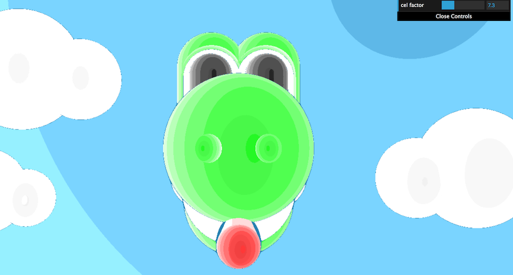
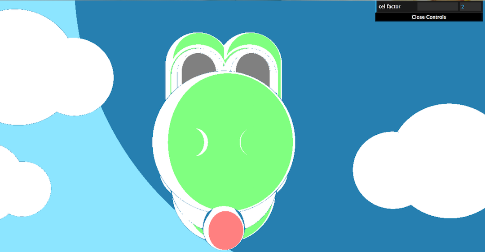

# Ray Marching Implicit Surfaces
Animated Yoshi scene using ray marching and implicit surfaces.

## Description
My scene is an animated Yoshi sticking his tongue out. It is rendered using a ray-marching technique with implicit functions defining the geometry. I use lambert and blinn-phong shading models, but modified it with a Cel-shading technique tweakable by the cel factor parameter. I also created a sceneSDF mapping function that loops through the various colored SDFs in my scene to create more material variety. The animation uses hand-tweaked trigonometric curves with some absolute values. The camera and light source positions are fixed.

## Running the Code

1. [Install Node.js](https://nodejs.org/en/download/).

2. Using a command terminal, run `npm install` in the root directory of your project.

3. Run `npm start` and then go to `localhost:5660` in your web browser
